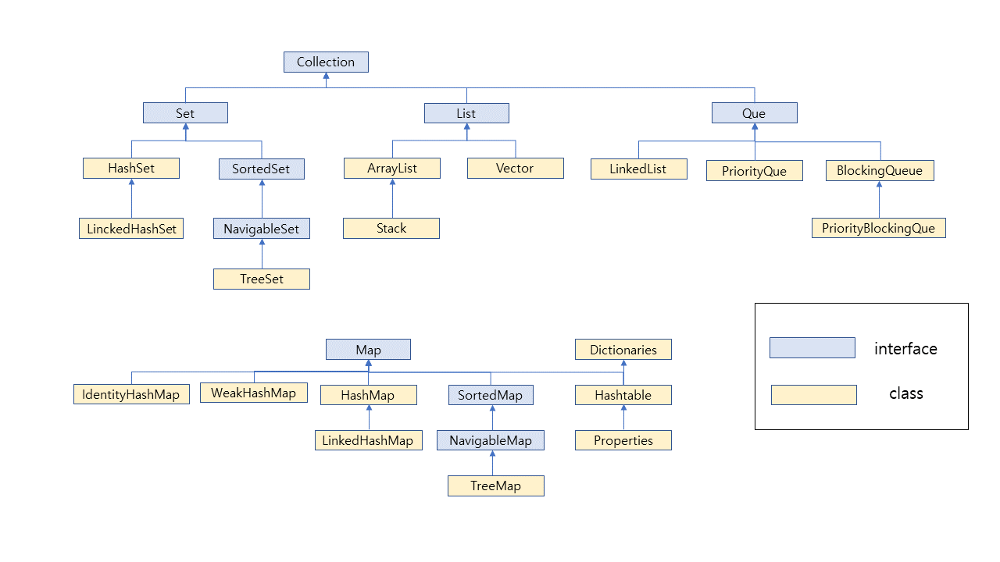

# Collection Framework

Java의 JDK는 프로그램 개발에 필요한 기초적인 자료 구조들을 거의 대부분 컬션\(collection\)으로 만들어 제공한다. 배열은 여러 개의 데이터를 다루는 데 매우 편리한 자료 구조이지만, 삽입/삭제가 빈번하고, 데이터의 크기를 예측할 수 없는 응용프로그램에 사용하기에 불편하다.

컬렉션은 고정 크기의 배열이 가지는 단점을 극복하고, 요소\(element\)라고 불리는 객체들의 삽입, 삭제, 검색 기능을 갖춘 가변 크기의 컨테이너\(container\)이다. 

### 컬렉션 인터페이스와 클래스 

<table>
  <thead>
    <tr>
      <th style="text-align:left">List</th>
      <th style="text-align:left">Set</th>
      <th style="text-align:left">Map</th>
    </tr>
  </thead>
  <tbody>
    <tr>
      <td style="text-align:left">&#xC21C;&#xC11C;&#xAC00; &#xC788;&#xB294; &#xB370;&#xC774;&#xD130;&#xC758;
        &#xC9D1;&#xD569;, &#xB370;&#xC774;&#xD130;&#xC758; &#xC911;&#xBCF5;&#xC744;
        &#xD5C8;&#xC6A9;</td>
      <td style="text-align:left">&#xC21C;&#xC11C;&#xB97C; &#xC720;&#xC9C0;&#xD558;&#xC9C0; &#xC54A;&#xB294;
        &#xB370;&#xC774;&#xD130;&#xC758; &#xC9D1;&#xD569;, &#xB370;&#xC774;&#xD130;&#xC758;
        &#xC911;&#xBCF5;&#xC744; &#xD5C8;&#xC6A9;&#xD558;&#xC9C0; &#xC54A;&#xC74C;</td>
      <td
      style="text-align:left">
        
&#xD0A4;(key)&#xC640; &#xAC12;(value)&#xC758; &#xC30D;&#xC73C;&#xB85C;
          &#xC774;&#xB8E8;&#xC5B4;&#xC9C4; &#xB370;&#xC774;&#xD130;&#xC758; &#xC9D1;&#xD569;

        
&#xC21C;&#xC11C;&#xB294; &#xC720;&#xC9C0;&#xB418;&#xC9C0; &#xC54A;&#xC73C;&#xBA70;
          &#xAC12;&#xC758; &#xC911;&#xBCF5;&#xC740; &#xD5C8;&#xC6A9;&#xB418;&#xC9C0;&#xB9CC;
          &#xD0A4;&#xC758; &#xC911;&#xBCF5;&#xC740; &#xD5C8;&#xC6A9;&#xD558;&#xC9C0;
          &#xC54A;

        </td>
    </tr>
    <tr>
      <td style="text-align:left">ArrayList, LinckedList, Stack, Vector...</td>
      <td style="text-align:left">HashSet, TreeSet, Sorted...</td>
      <td style="text-align:left">HashMap, TreeMap, HashTable, LinckedHashMap, SortedMap, Properties...</td>
    </tr>
  </tbody>
</table>

### 컬렉션의 특

* 컬렉션은 제너릭\(generics\)이라는 기법으로 구현되어 있다. 클래스나 인터페이스에 &lt;E&gt;, &lt;K&gt;, &lt;V&gt;등으로 표현된 타입 매개 변수들이 있고 컬렉션의 요소를 일반화시킨 타입이다.
* 컬렉션의 요소는 객체들만 가능하다. int, char, double등의 기본 타입의 테이터는 컬렉션의 요소로 불가능하다.

### 

